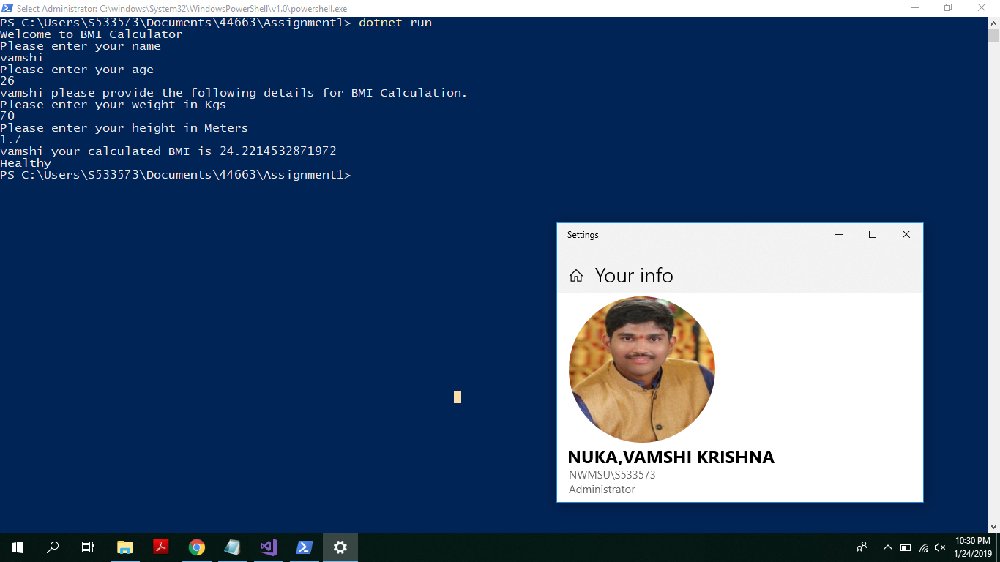

## Assignment1

#BMI Calculator
- My app asks for users name, age, weight, height.
- It prompts user access only if user is adult. 
- Based on the given values it tells users his/her status of health.

#How to run my program
- To run program user need to open the powershell as admininstrator first.
- Set the folder path.
- Now type the dotnet run command and follow the instructions.
- Happy coding.